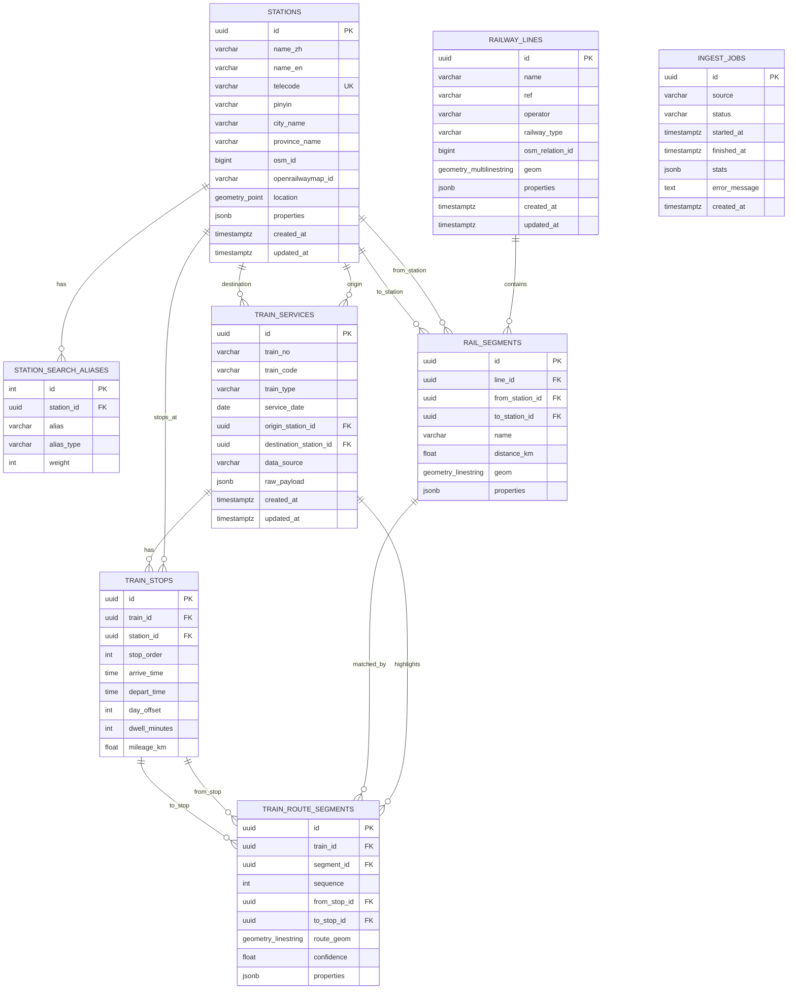

# 数据库 ER 图

## 关键索引

- `stations.location`：GiST 空间索引，用于地图视野内车站查询。
- `rail_segments.geom`：GiST 空间索引，用于铁路地图图层和经路匹配。
- `train_route_segments.route_geom`：GiST 空间索引，用于高亮线路空间查询。
- `stations.name_zh`、`station_search_aliases.alias`、`train_services.train_no`、`train_services.train_code`：GIN + `pg_trgm`，用于模糊搜索。

## 数据来源映射

- OpenStreetMap：`stations.osm_id`、`railway_lines.osm_relation_id`、`rail_segments.geom`。
- OpenRailwayMap：`openrailwaymap_id`、`railway_type`、`properties` 中的电气化、轨距、限速、运营状态等标签。
- cr-12306-train-info：`train_services`、`train_stops`、`raw_payload`。
